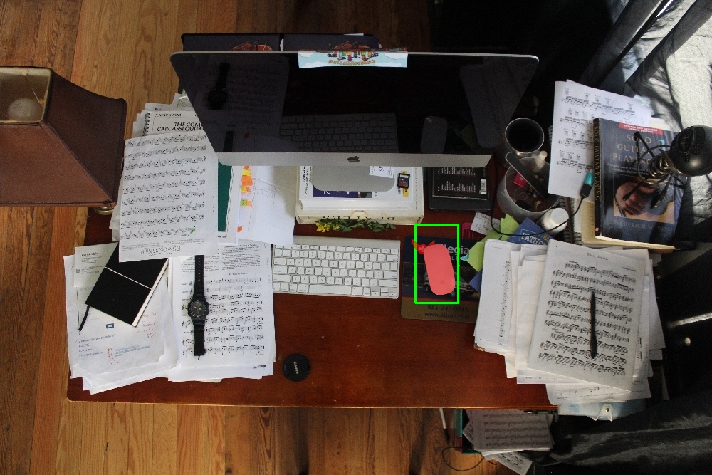
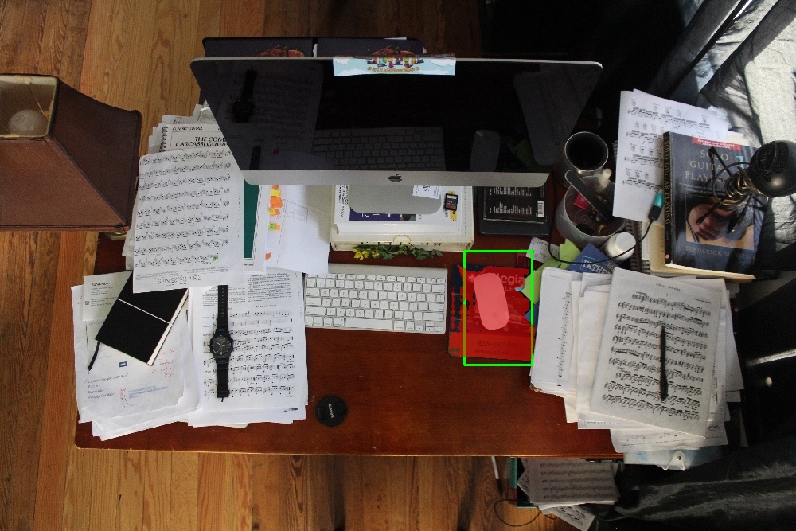
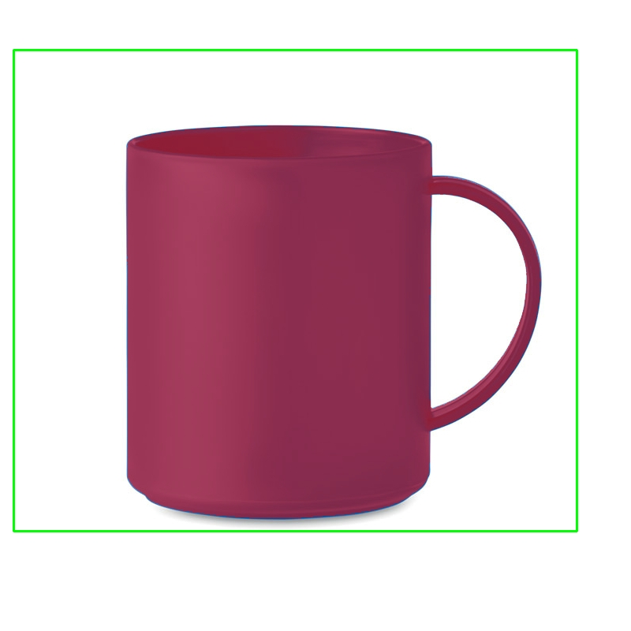
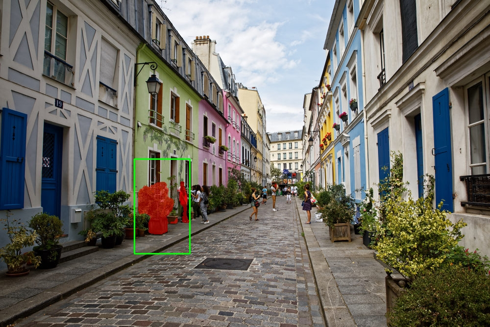
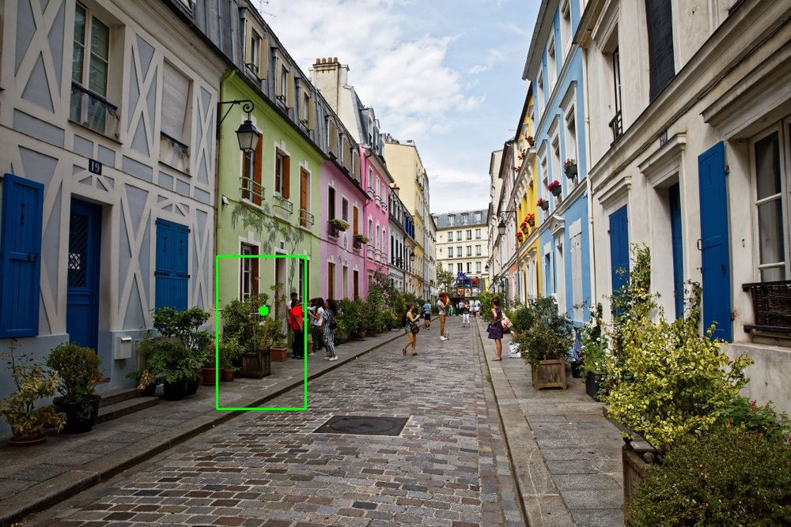

# Rapport TP1

## Exercice 1 : Initialisation du dépôt, réservation GPU, et lancement de la UI via SSH

## Dépôt et architecture du code

- Lien vers dépot : [Github](https://github.com/valentinedum/CSC8608)
- Lieu d'exécution du TP : **SLURM**
- Architecture du TP :


## Setup Environnement

Nom environnement conda : `deeplearning`
Versions :
```bash
torch 2.5.1
cuda_available True
device_count 1
```

Nous installons les `requirements.txt`. SAM est bien installé :


## Forwarding du port Streamlit

- **Port choisi** : 8542
- **Infrastructure** : Utilisation d'un tunnel SSH avec rebond (Jump Host) pour atteindre le nœud GPU `arcadia-slurm-node-2` via `tsp-client`.
- **Commande de tunnel (exécutée sur PC local)** : 
  `ssh -L 8542:arcadia-slurm-node-2:8542 tsp-client`
- **UI accessible via SSH tunnel** : Oui.

## Exercice 2 : Constituer un mini-dataset (jusqu’à 20 images)

On va récuperer des images sur le net pour ces cas intéressants:
- 3 Simples : Une tasse (`simple_mug.jpg`), un smartphone (`simple_smartphone.jpg`), un fruit (`simple_fruit.png`)

- 3 Chargées : Un bureau en désordre (`charge_bureau.jpg`), une rue (`charge_rue.jpg`), un rayon de supermarché (`charge_supermarche.jpg`).

- 2 Difficiles : Des lunettes (transparence) avec `complexe_lunettes.jpg`, un vélo (rayons fins) avec `complexe_velo.jpg`, ou des cheveux avec `complexe_cheveux.jpg`.


Puis on va les completer avec des photos aléatoires depuis l'API **picsum** avec le script `TP1/src/generate_dataset.py`

## Exercice 3 : Charger SAM (GPU) et préparer une inférence “bounding box → masque”

### Téléchargement de SAM


### Test Sam

Après configuration de sam pour prédire les masques, on le teste : 


**Constat suite au test rapide** :
- Réussite technique : Le chargement sur GPU est effectif (pas d'erreur CUDA) et le modèle **vit_h** répond en un temps raisonnable malgré sa taille.
- Comportement de SAM : Le score de **0.86** montre que même avec une bounding box "arbitraire", le modèle parvient à extraire une structure cohérente.

## Exercice 4 : Mesures et visualisation : overlay + métriques (aire, bbox, périmètre)

Nous maintenant produire des sorties “exploitables” : une visualisation claire en créant les scripts `geom_utils.py` et `viz_utils.py`.

Nous pouvons tester que tout fonctionne avec ce tableau des résultats: 

|Image         |Score SAM|Aire (pixels)|Périmètre (pixels)|
|--------------|---------|-------------|------------------|
|random_8.jpg  |0.8622   |17 575       |1152.06           |
|random_2.jpg  |0.8419   |2 958        |654.88            |
|simple_mug.jpg|0.8447   |52 018       |2732.63           |

Voici l'exemple de random_8.jpg : 


On voit que SAM a reussi à delimiter le gris très sombre du ciel des nuages plus claires.

**Utilité de l'overlay pour le "debug"**
L'overlay (le masque rouge) nous permet de voir ce que l'IA a compris. Sans ça, on aurait juste un score et une aire, mais on ne saurait pas si SAM a bien entouré l'objet ou s'il a fait n'importe quoi.

Par exemple, sur mes tests, ça permet de 'débugger' tout de suite : si je vois que le rouge déborde sur le décor, je sais que ma boîte (le cadre vert) est trop large ou que l'image est trop compliquée pour lui. C'est aussi là qu'on voit si SAM est 'fainéant' : parfois il ne colorie qu'un petit bout de l'objet au lieu de tout prendre. L'image nous montre tout de suite si le modèle a réussi son coup ou s'il s'est perdu dans les détails.


## Exercice 5 : Mini-UI Streamlit : sélection d’image, saisie de bbox, segmentation, affichage et sauvegarde

Nous allons maintenant assembler les briques précédentes dans une mini-UI Streamlit. Pour cela, nous modifions le fichier `TP1/src/app.py`

**Résultats**

|Image         |Cas de test|Score |Aire (px)|Temps (ms)|
|--------------|-----------|------|---------|----------|
|Mug           |Simple (Objet isolé)|0.996 |193 940  |1631.3    |
|Souris        |Précis (BBox serrée)|0.986 |2 630    |1643.2    |
|Souris        |Ambigu (BBox large)|0.952 |10 060   |1634.8    |


### Cas complexe Souris dans environnement chargé





>il faut que la souris soit encadrée précisément pour que l bon objet soit detecter.

### Cas simple Mug



>Une segmentation quasi parfaite avec un score maximal.

### Impact BBox

L'ajustement de la BBox est déterminant pour la précision de SAM. Une boîte trop large crée de l'ambiguïté : dans mon test sur la souris, le modèle a inclus le tapis de souris, multipliant l'aire par quatre et faisant baisser le score de confiance. À l'inverse, une boîte serrée force SAM à isoler l'objet exact, produisant un masque net et un score optimal (0.98+). L'overlay est donc essentiel pour vérifier que le "prompt" (la boîte) ne capture pas d'éléments parasites du décor.

## Exercice 6 : Affiner la sélection de l'objet : points FG/BG + choix du masque (multimask)

Nous allons affiner la selection de l'objet en donnant à SAM des points de guidage pour différencier le fond de l'objet et éviter qu'ils selectionnent plusieurs objets en pensant que ça n'en est qu'un.

Sans les points d'aide de FG et BG, SAM pense que le mask d'index 2 est le meilleur. Or la personne sur la droite n'est pas le meme objet que la plante.

Voici un exmple des paramètres avec une bbox seule.


```json
{"scores":[0.9154070019721985,0.9289053678512573,0.9351819753646851],"time_ms":1642.7719593048096}

{"mask_idx":2,"score":0.9351819753646851,"area_px":6471,"mask_bbox":[282,361,386,477],"perimeter":594.6173115968704}
```



>La box étant un peu plus grande que l'objet qu'on voulait initialement détecter (plante verte), Sam détecte aussi la personne sur la droite, comme objet.

Nous rajaoutons deux points: un de background ainsi qu'un point de foreground :

```json
{"n_points":2,"points":[[375,393,0],[333,393,1]]}
```




```json
{"scores":[0.936403751373291,0.9537061452865601,0.9325786828994751],"time_ms":1635.0605487823486}

{"mask_idx":1,"score":0.9537061452865601,"area_px":5285,"mask_bbox":[282,317,355,477],"perimeter":384.04877042770386}
```


>SAM a été aidé par les points marqués. Maintenant l'objet est le bon.

### Conclusion

Les points de Background (BG) sont très utiles quand l'objet qu'on veut détourer touche un autre élément qui lui ressemble (même couleur ou texture). Par exemple, dans la rue, placer un point rouge sur le passant juste à côté de la plante permet de "dire" à SAM de s'arrêter là et de ne pas tout fusionner dans le même masque. Sans ça, l'IA a tendance à faire un gros bloc qui englobe tout le contenu de la boîte.

Par contre, il reste quelques cas difficiles lorsque :

- Les détails sont trop fins
- L'image presente de la transparence : sur un verre ou une vitre, SAM s'embrouille parce qu'il voit à travers.

## Exercice 7 : Bilan et réflexion (POC vers produit) + remise finale

### Quels sont les 3 principaux facteurs qui font échouer votre segmentation (sur vos images), et quelles actions concrètes (data, UI, pipeline) permettraient d’améliorer la situation.

Les principaux facteurs d'échec de SAM pour l'identification d'un objet sont l'mabiguité du contexte si des objets se chevauchent ou sont à touche touche avec des textures et couleurs similaires. Il y a aussi la transparence, dans ce cas, SAM n'arrive pas à faire la différence entre l'objet et le fond. Enfin il ya les structures très fines telles que les roues d'un vélo. Ces détails ne sont pas détectés par SAM.
Concrétement, il seraient possible d'affiner la detection en entrainant de nouveau le modèle sur des images + masques de précision.
Sinon, côté UI on pourrait permettre le tracer à la main ou la pose des box et points directement sur l'image. 
Dernieremeny, on pourrait changer le modèle et passer de `vit_b` à `vit_h` pour gagner en performances.


### Si vous deviez industrialiser cette brique, que loggueriez-vous et que monitoreriez-vous en priorité ? Donnez au minimum 5 éléments.

Pour industrialiser cette solution, il faudrait en priorité surveiller ces éléments :
- le temps de réponse de l'app Streamlit. Si jamais le temps décolle pour certains utilisateurs alors le serveur sature.
- la moyenne des scores de confiances. Si SAM commence à donner des scores anormaux sur des nouvelles images alors les données réelles sont surmeent différentes de celles d'entrainement.
- le taux d'abandon des sessions. Peut-être l'app est-elle trop complexe pour les utilisateurs.
- le nombre de points de guidage. Pour cela, il faudrait voir si les gens ont tendance à en mettre beaucoup. Si oui, le modèle est mauvais à la tâche.
- le choix du masque. Est-ce que les utilisateurs prennent le premier masque ou en choisisse d'autres.
Ce ne sont que des suggestions, il y aurait surement d'autres choses à surveiller.