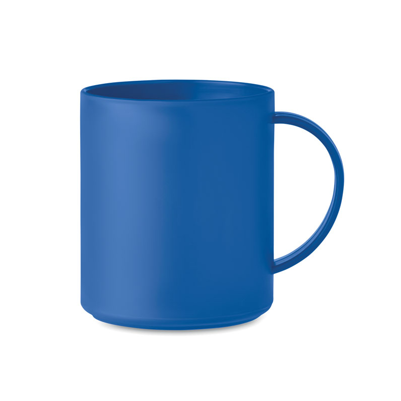
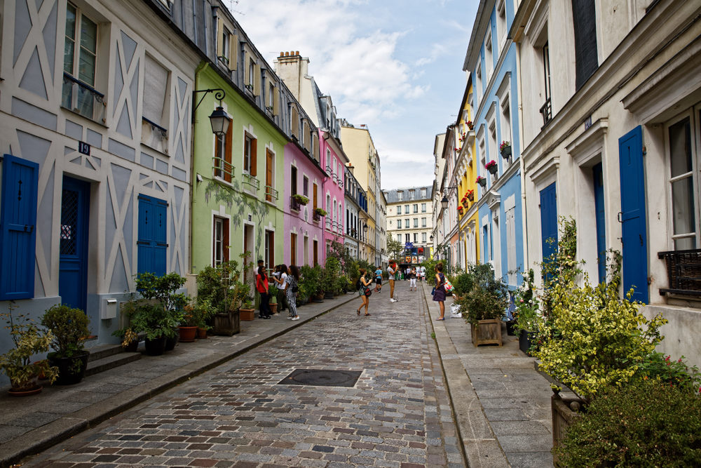
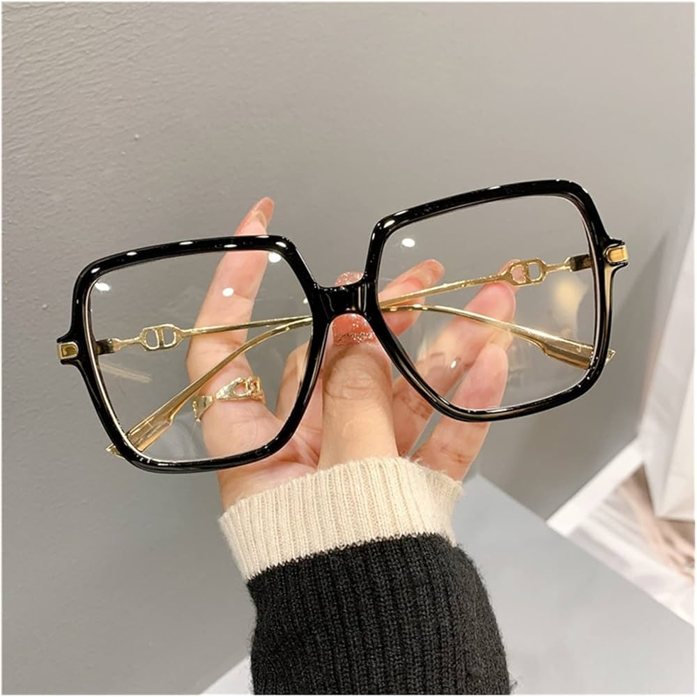
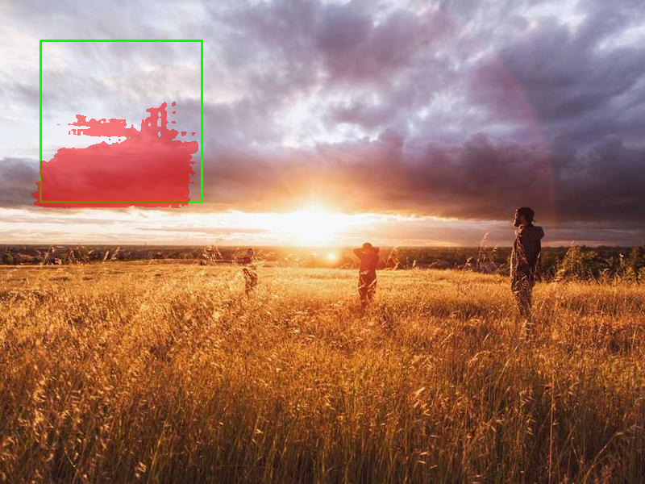

# Rapport TP1

## Exercice 1 : Initialisation du dépôt, réservation GPU, et lancement de la UI via SSH

## Dépôt et architecture du code

- Lien vers dépot : [Github](https://github.com/valentinedum/CSC8608)
- Lieu d'exécution du TP : **SLURM**
- Architecture du TP :


## Setup Environnement

Nom environnement conda : `deeplearning`
Versions :
```bash
torch 2.5.1
cuda_available True
device_count 1
```

Nous installons les `requirements.txt`. SAM est bien installé :


## Forwarding du port Streamlit

- **Port choisi** : 8542
- **Infrastructure** : Utilisation d'un tunnel SSH avec rebond (Jump Host) pour atteindre le nœud GPU `arcadia-slurm-node-2` via `tsp-client`.
- **Commande de tunnel (exécutée sur PC local)** : 
  `ssh -L 8542:arcadia-slurm-node-2:8542 tsp-client`
- **UI accessible via SSH tunnel** : Oui.

## Exercice 2 : Constituer un mini-dataset (jusqu’à 20 images)

On va récuperer des images sur le net pour ces cas intéressants:
- 3 Simples : Une tasse (`simple_mug.jpg`), un smartphone (`simple_smartphone.jpg`), un fruit (`simple_fruit.png`)

- 3 Chargées : Un bureau en désordre (`charge_bureau.jpg`), une rue (`charge_rue.jpg`), un rayon de supermarché (`charge_supermarche.jpg`).

- 2 Difficiles : Des lunettes (transparence) avec `complexe_lunettes.jpg`, un vélo (rayons fins) avec `complexe_velo.jpg`, ou des cheveux avec `complexe_cheveux.jpg`.


Puis on va les completer avec des photos aléatoires depuis l'API **picsum** avec le script `TP1/src/generate_dataset.py`

## Exercice 3 : Charger SAM (GPU) et préparer une inférence “bounding box → masque”

### Téléchargement de SAM


### Test Sam

Après configuration de sam pour prédire les masques, on le teste : 


**Constat suite au test rapide** :
- Réussite technique : Le chargement sur GPU est effectif (pas d'erreur CUDA) et le modèle **vit_h** répond en un temps raisonnable malgré sa taille.
- Comportement de SAM : Le score de **0.86** montre que même avec une bounding box "arbitraire", le modèle parvient à extraire une structure cohérente.

## Exercice 4 : Mesures et visualisation : overlay + métriques (aire, bbox, périmètre)

Nous maintenant produire des sorties “exploitables” : une visualisation claire en créant les scripts `geom_utils.py` et `viz_utils.py`.

Nous pouvons tester que tout fonctionne avec ce tableau des résultats: 

|Image         |Score SAM|Aire (pixels)|Périmètre (pixels)|
|--------------|---------|-------------|------------------|
|random_8.jpg  |0.8622   |17 575       |1152.06           |
|random_2.jpg  |0.8419   |2 958        |654.88            |
|simple_mug.jpg|0.8447   |52 018       |2732.63           |

Voici l'exemple de random_8.jpg : 


On voit que SAM a reussi à delimiter le gris très sombre du ciel des nuages plus claires.

**Utilité de l'overlay pour le "debug"**
L'overlay (le masque rouge) nous permet de voir ce que l'IA a compris. Sans ça, on aurait juste un score et une aire, mais on ne saurait pas si SAM a bien entouré l'objet ou s'il a fait n'importe quoi.

Par exemple, sur mes tests, ça permet de 'débugger' tout de suite : si je vois que le rouge déborde sur le décor, je sais que ma boîte (le cadre vert) est trop large ou que l'image est trop compliquée pour lui. C'est aussi là qu'on voit si SAM est 'fainéant' : parfois il ne colorie qu'un petit bout de l'objet au lieu de tout prendre. L'image nous montre tout de suite si le modèle a réussi son coup ou s'il s'est perdu dans les détails.


## Exercice 5 : Mini-UI Streamlit : sélection d’image, saisie de bbox, segmentation, affichage et sauvegarde