# Rapport TP2

## Exercice 1 : Mise en place & Smoke Test (GPU + Diffusers)

Pour valider l'installation et l'accès au GPU, nous avons exécuté le script `TP2/smoke_test.py` qui génère une image 512x512 avec Stable Diffusion v1.5.

**Commande d'exécution :**

```bash
python TP2/smoke_test.py
```

**Image générée :**

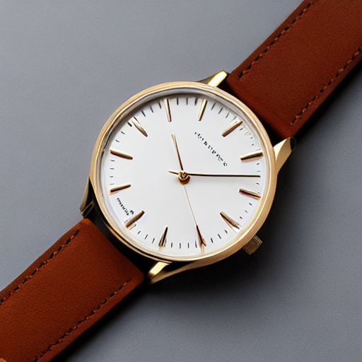

## Exercice 2 : Factorisation du pipeline (text2img/img2img) et exposition des paramètres

Le chargement du pipeline a été factorisé dans `TP2/pipeline_utils.py` pour centraliser la gestion du modèle, du scheduler, du device et de la seed. Le script `TP2/experiments.py` permet de générer une image baseline en text2img avec des paramètres explicitement définis.

**Commande d'exécution :**

```bash
python TP2/experiments.py
```

**Configuration utilisée :**

| Paramètre | Valeur                                      |
| --------- | ------------------------------------------- |
| model_id  | stable-diffusion-v1-5/stable-diffusion-v1-5 |
| scheduler | EulerA                                      |
| seed      | 42                                          |
| steps     | 30                                          |
| guidance  | 7.5                                         |

**Image générée :**

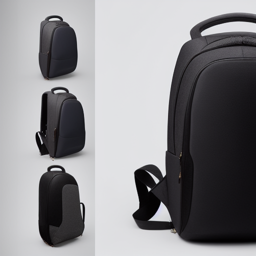

L'image générée est effectivement un sac à dois noir sur fond blanc. Ici, elle combine plusieurs photos sous plusieurs angles.


## Exercice 3 : Text2Img — 6 expériences contrôlées (param)

Nous avons généré 6 images en faisant varier les paramètres steps, guidance et scheduler, tout en gardant le même prompt e-commerce (`"ultra-realistic product photo of a pair of running shoes on a white background, studio lighting, soft shadow, very sharp"`) avec une nouvelle fonction dans le script `TP2/experiments.py`

**Grille des résultats :**

| Image 	| paramètres 	| 
|-------	|------------	|
|       	|   {'scheduler': 'EulerA', 'seed': 42, 'steps': 30, 'guidance': 7.5}         	|
|   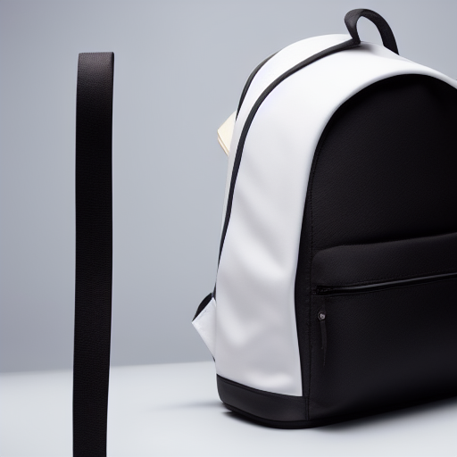    	|  {'scheduler': 'EulerA', 'seed': 42, 'steps': 15, 'guidance': 7.5}          	|
|   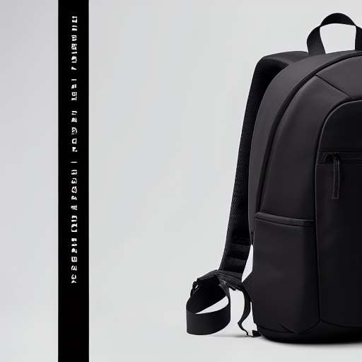    	|   {'scheduler': 'EulerA', 'seed': 42, 'steps': 50, 'guidance': 7.5}         	|
|   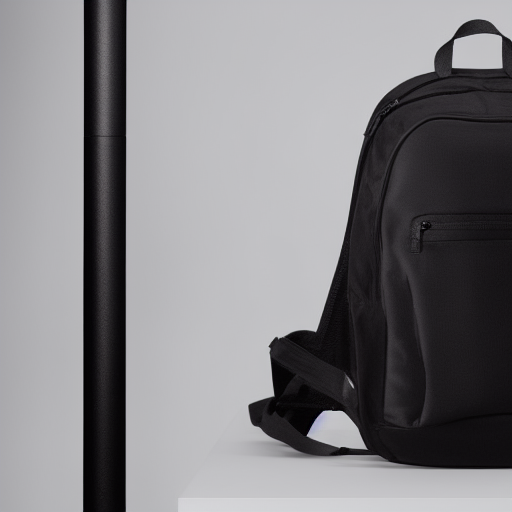    	|   {'scheduler': 'EulerA', 'seed': 42, 'steps': 30, 'guidance': 4.0}         	|
|    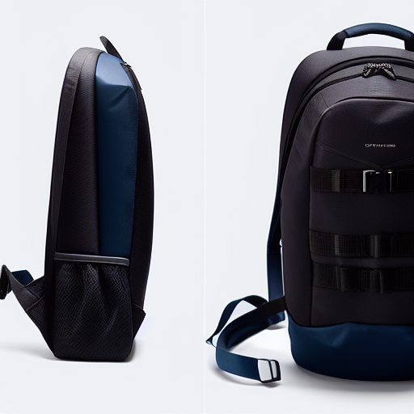   	|     {'scheduler': 'EulerA', 'seed': 42, 'steps': 30, 'guidance': 12.0}       	|
|       	|   {'scheduler': 'DDIM', 'seed': 42, 'steps': 30, 'guidance': 7.5}         	|

**Analyse de l'influence des paramètres**:

- **steps** : Plus il y a de steps plus l'image est détaillé. Le sac avec 15 steps est beaucoup plus sobre et avec moins de contraste, reflets que celui avec 50 steps.
- **guidance** : Auglenter la guidance à l'aire de rajouter de la créativité à la génération. Le sac avec 4 de guidance est extremmemnt simple avec une grosse poche principale. Celui avec la guidance de 12 à des parties bleues, des lanières plus esthétiques et une boucle métallique au milieu
- **scheduler** : Le scheduler DDIM donne un rendu différent d’EulerA. Le style est différent, le fond est moins monochrome.

## Exercice 4 : Img2Img : 3 expériences contrôlées (strength faible/moyen/élevé)

Cette fois-ci, nous rajoutons une fonction pour faire 3 générations controlées en image-to-image avec cette image de base :

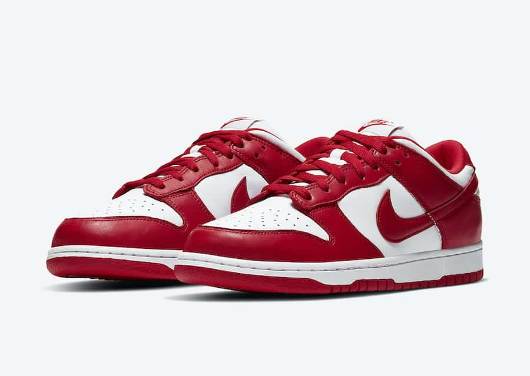

**Grille des résultats :**

| Image 	| paramètres 	| 
|-------	|------------	|
| 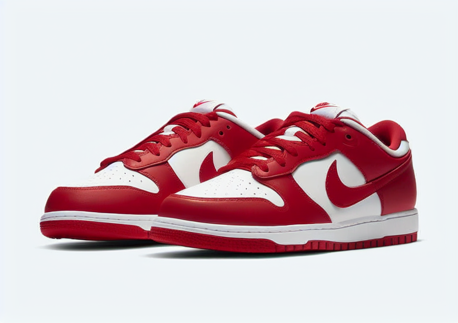      	|   {'scheduler': 'EulerA', 'seed': 42, 'steps': 30, 'guidance': 7.5, 'strength': 0.35}        	|
|   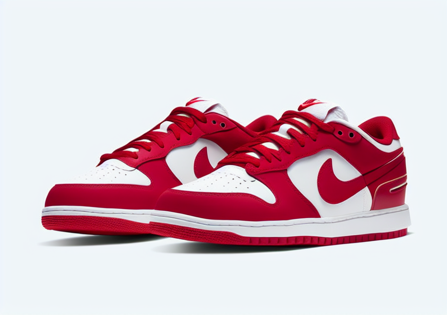    	|  {'scheduler': 'EulerA', 'seed': 42, 'steps': 30, 'guidance': 7.5, 'strength': 0.6}         	|
|   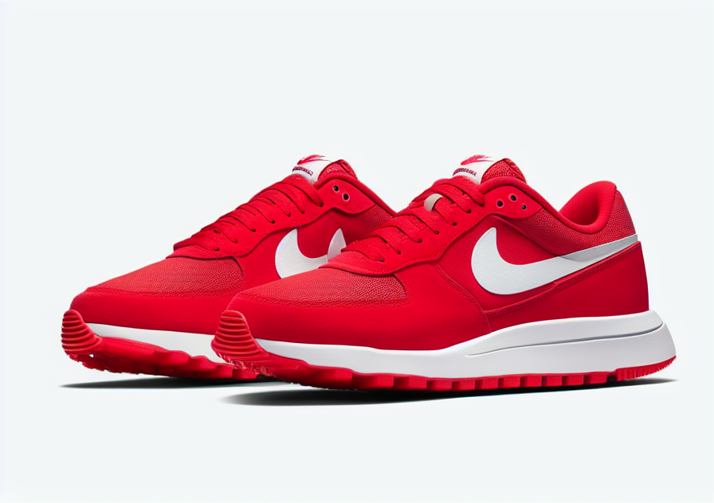   	|   {'scheduler': 'EulerA', 'seed': 42, 'steps': 30, 'guidance': 7.5, 'strength': 0.85}        	|

**Analyse de l'influence de la strength**:

- `strength=0.35`, la forme globale, l'identité du produit (type de chaussure), le cadrage et la pose sont bien préservés.
- `strength=0.60`, la silhouette et le cadrage restent reconnaissables, mais certains détails commencent à changer (textures, couleurs).
- `strength=0.85`, la forme générale a carrement changé, le produit n'est plus le même.

**Utilisabilité e-commerce :**
Pour l'e-commerce, il faut éviter de trop augmenter la `strength` pour garantir la fidélité visuelle du produit. Mais, il faut quand même en mettre un petit peu pour profiter des avantages de la génération d'image (amélioration d'ambiance, nettoyage d'image etc)

## Exercice 5 : Mini-produit Streamlit (MVP) : Text2Img + Img2Img avec paramètres

Maintenant, nous créons une petite application streamlit laissant l'utilisateur faire au choix du text to image ou image to image.

### Essai Text2img

Voici un exemple de **Text2img** : 


Voici une image plus claire du casque :

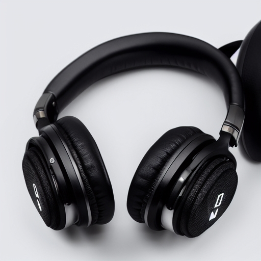

### Essai Img2Img

Voici un exemple de **Img2Img** :


Voici l'image de départ :
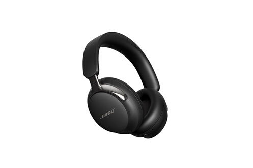

Et voici l'image (très créative) générée :
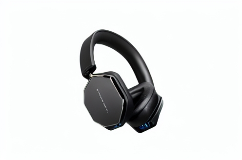

## Exercice 6 : Évaluation (léger) + réflexion (à finir à la maison)

### Grille d’évaluation (0–2 par critère, total /10)

| Image | Prompt adherence | Visual realism | Artifacts | E-commerce usability | Reproducibility | Total |
|-------|------------------|---------------|-----------|---------------------|-----------------|-------|
| Baseline text2img (t2i_run01_baseline.png) | 2 | 2 | 2 | 2 | 2 | 10 |
| Text2img extrême avec (t2i_run05_guid12.png) | 2 | 1 | 1 |0 | 2 | 6 |
| Img2img strength élevé (i2i_run09_strength085.png) | 2 | 2 | 2 | 0 | 2 | 8 |

**Justifications :**

- Run 01 (Baseline) — Score 10/10 : Le standard idéal avec un rendu "studio" net, un éclairage neutre et une géométrie parfaitement respectée, rendant l'image immédiatement exploitable pour une fiche produit.
- Run 05 (High Guidance) — Score 6/10 : La guidance excessive (>10) sature l'image et force des incohérences physiques (chevauchement impossible des bretelles en bas à gauche), créant un rendu "glitché" inutilisable en e-commerce.
- Run 09 (High Strength) — Score 8/10 : Un piège classique où la qualité technique est parfaite (photoréalisme bluffant) mais l'utilisabilité est nulle car le produit a totalement changé, constituant une publicité mensongère.

### Réflexion

La génération d'images demande un compromis entre qualité et latence : si augmenter les steps d'inférence affine les détails, le coût GPU et donc la latence croit. Avec des steps elevés (60), je suis même arrivée à des `"Cuda out of memory"`.
Il est donc nécessaire de choisir un scheduler optimisé (ex: EulerA à 30 steps) pour un ratio coût/qualité viable.

La reproductibilité est aussi fragile. Elle exige le stockage strict non seulement du prompt, mais surtout de la seed, du scheduler et de la version précise du modèle, sans quoi l'industrialisation de ce processus de génération d'images sera mauvaise.

Enfin, l'usage e-commerce présente des risques critiques d'hallucinations (logos inventés, géométrie du produit altérée) pouvant mener à de la publicité mensongère. Pour mitiger ces risques, il est impératif de brider le denoising strength mais aussi d'utiliser des negative prompts robustes pour exclure des caractéristiques non désirées, et de maintenir une validation humaine systématique basée sur des grilles d'évaluation standardisées (comme fait au-dessus).