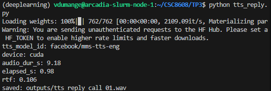
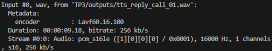
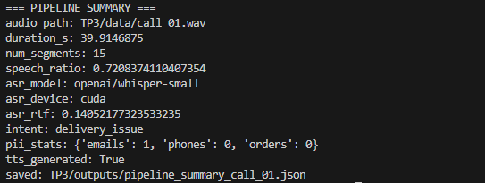

# Rapport TP3

## Exercice 1 : Initialisation du TP3 et vérification de l’environnement

Voici le sanity check :


## Exercice 2 : Constituer un mini-jeu de données : enregistrement d’un “appel” (anglais) + vérification audio

Nous enregistrons un échantillons d'un appel téléphonique dans `TP3/data/call_01.wav`. Puis nous vérifions ses métadonnées.

**Métadonnées audio :**
- **Durée :** 39.91 secondes (~40s)
- **Sample rate :** 48000 Hz
- **Canaux :** 1 (mono)
- **Codec :** PCM 16-bit signed LE
- **Bitrate :** 768 kb/s

Le fichier est raisonnable en temps, mono mais est en 48kHz , nous le convertissons en 16kHz.

```bash
ffmpeg -i TP3/data/call_01.wav -ar 16000 -ac 1 TP3/data/call_01_16k.wav
mv TP3/data/call_01_16k.wav TP3/data/call_01.wav
```

Nous créons ensuite un script `TP3/inspect_audio.py` pour afficher la forme du tenseur, le sample rate, la durée, et quelques statistiques simples (RMS, taux de clipping).


Il n'y a pas clipping, donc l'audio ne continet pas de saturation. Et le RMS est de **rms: 0.0606**. On voit bien qu'on est passé sur du **16kHz** de sample rate ce qui représente environ **600 000** échantillons.

## Exercice 3 : VAD (Voice Activity Detection) : segmenter la parole et mesurer speech/silence

Nous créons, à présent le script `TP3/vad_segment.py` qui utilise un vad prêt à l'emploi pour produire une liste de segments et calculer des statistiques dessus.

Nous avons besoin pour cela d'installer silero_vad :

```bash
pip install silero_vad
```


**Extrait du JSON (5 premiers segments) :**
```json
{
  "audio_path": "TP3/data/call_01.wav",
  "sample_rate": 16000,
  "duration_s": 39.9146875,
  "min_segment_s": 0.3,
  "segments": [
    {
      "start_s": 0.226,
      "end_s": 0.766
    },
    {
      "start_s": 0.962,
      "end_s": 2.974
    },
    {
      "start_s": 3.426,
      "end_s": 5.758
    },
    {
      "start_s": 6.434,
      "end_s": 9.182
    },
    {
      "start_s": 9.57,
      "end_s": 12.542
    },
    ]
}
```

**Analyse :** Le ratio de parole est **75.8%**, ce qui est cohérent pour un discours naturel avec des pauses courtes (respiration, ponctuation). Les 18 segments détectés sont cohérents avec les 9 phrases dites.

Nous augmentons le filtrage `min_dur_s` pour le rendre plus strict, le faisant passer de **0.3** à **0.6**. Nous avons maintenant **15** segments au lieu de **18** et un speech ratio de **72.1%** contre **75.8%**.

## Exerice 4 : ASR avec Whisper : transcription segmentée + mesure de latence

Maintenant, nous créons le script `TP3/asr_whisper.py` qui transcrit les segments VAD. Comme nous avons accès au GPUs des serveurs de TSP, nous choisissons le model **whisper-small**.

Une petite erreur de compatibilité se trouve entre trasnformers/whisper avec `num_frames`, nous installons les dépendances:

```bash
pip install -U transformers soundfile
```


Le modèle n'est pas trop grand, on pourrait limite en prendre un encore plus grand car il a mis 10 sec à transcrire

**Extrait de la transcription (5 premiers segments et quelques lignes du full_text) :**
```json
"segments": [
    {
      "segment_id": 0,
      "start_s": 0.962,
      "end_s": 2.974,
      "text": "Thank you for calling customer support."
    },
    {
      "segment_id": 1,
      "start_s": 3.426,
      "end_s": 5.758,
      "text": "My name is Alex and I will help you today."
    },
    {
      "segment_id": 2,
      "start_s": 6.434,
      "end_s": 9.182,
      "text": "I'm calling about an order that arrived damaged."
    },
    {
      "segment_id": 3,
      "start_s": 9.57,
      "end_s": 12.542,
      "text": "The package was delivered yesterday, but the screen is cracked."
    },
    {
      "segment_id": 4,
      "start_s": 13.25,
      "end_s": 16.99,
      "text": "I would like a refund or a replacement as soon as possible."
    },
]
"full_text": ... "I would like a refund or a replacement as soon as possible. The order is a... X, one, nine, seven, eight. three, five. You can reach me at john.smiths. Example. .com. also. My phone number is... five, five, five. 0199."
```

**Analyse de l'impact VAD/ASR :** La segmentation VAD semble aider au traitement par chunks (**RTF 0.25**), mais **gêne** la transcription pour les données structurées (numéros, emails). Les pauses entre lettres/chiffres épelées sont interprétées comme des fins de segment, d'où les fragments isolés ("The order is a..." + "X, one, nine, seven, eight."). Email et téléphone sont morcelés : "john.smiths." / "Example." / ".com." / "0199.". Une post-processing améliorerait la cohérence. En conclusion, pour les scripts naturels, VAD fonctionne bien mais pour du contenu structuré un peu moins.

## Exercice 5 : Call Center Analytics (Intent, PII, Termes fréquents)

Nous créons le script `TP3/callcenter_analytics.py` pour extraire l'intent, détecter les PII (Personally Identifiable Information), et lister les termes les plus fréquents.


```json
{
  ...
  "pii_stats": {
    "emails": 0,
    "phones": 0
  },
  "intent_scores": {
    "refund_or_replacement": 4,
    "delivery_issue": 6,
    "general_support": 5
  },
  "intent": "delivery_issue",
  "top_terms": [
    [
      "five",
      4
    ],
    [
      "calling",
      2
    ],
    [
      "order",
      2
    ],
    [
      "thank",
      1
    ],
    [
      "customer",
      1
    ],
    ...
  ],
  "redacted_text": ... "I would like a refund or a replacement as soon as possible. The order is a... X, one, nine, seven, eight. three, five. You can reach me at john.smiths. Example. .com." ...
```

**Analyse** : PII detection échoue car les emails et téléphones ont été fragmentés par VAD. On va rajouter un preprocessing pour normaliser les tokens et rajouter des masques.


**Comparaison avant/après :**
| Métrique | Avant | Après | Évolution |
|---|---|---|---|
| Emails détectés | 0 | 1 | ✓ |
| Phones détectés | 0 | 0 | — |
| Top Term | five | calling | ✓ |

### Réflexion courte

Les erreurs de transcription Whisper impactent de plusieurs manières les analytics.
D'abord, les numéros et emails épelés lentement sont fragmentés par VAD en segments isolés (ex: **"X, one, nine"** au lieu de **"A X 1 9 7 3 5"**), ce qui rend la détection PII critique et impossible sans post-processing. Donc avant normalisation, aucun numéro de téléphone/email n'était détecté. Après, 1 email est retrouvé.
Deuxièmement, ces fragments polluent fortement la fréquence des termes : **"five"** apparaît 4 fois du numéro épelé et devient artificiellement top-1, masquant les vrais termes avec du sens(**"calling"**, **"order"**).
Dernièrement, l'intention reste stable face aux différentes fragmentations car les termes clés (**"order"**, **"damaged"**, **"delivered"**) restent malgré le preprocessing. On retrouve donc **"delivery_issue"** (score 6).
Le post-traitement est indispensable mais devrait être mieux réalisé.

## Exercice 6 : TTS léger : générer une réponse “agent” et contrôler latence/qualité

Nous utilisons le modèle `microsoft/speecht5_tts` (après upgrade torch pour vulnérabilités CVE-2025-32434).

Pour le modele choisi `suno/bark-small`, il nous est demandé d'upgrader torch à la version 2.6 à cause de vulnérabilités sur la 2.5.

```bash
pip install -U torch
pip install --upgrade torchvision
pip install --upgrade torchaudio
```




L'audio produit est compatible avec un système ASR (16 kHz mono).

**Analyse :** La qualité de l'audio généré par le modèle TTS est acceptable pour un agent conversationnel, même si l'intonnation est légèrement baclée. Par exemple, on a du mal a comprendre quand est le début ou la fin d'une phrase. La **latence RTF 0.27** (3.7× plus rapide que temps réel) est excellente pour un agent conversationnel avec un temps réel acceptable pour les callcenters. L'audio est compatible ASR 16 kHz, permettant une boucle de feedback complet.

D'ailleurs, si on refait le schéma inverse (STT) sur l'audio produit, on remarque qu'en effet, on a l'impression que damaged est dans la phrase d'après. A part, ça tout est plutot bien.

```bash
text: Thanks for calling. I am sorry your order arrived. Demanged, I can offer a replacement or a refund. Please confirm your preferred auction.
```

## Exercice 7 : Intégration : pipeline end-to-end + rapport d’ingénierie (léger)

On écrit un nouveau script pour dérouler toute la pipeline VAD -> ASR -> Analytics -> TTS : `TP3/run_pipeline.py`



```json
{
  "audio_path": "TP3/data/call_01.wav",
  "duration_s": 39.9146875,
  "num_segments": 15,
  "speech_ratio": 0.7208374110407354,
  "asr_model": "openai/whisper-small",
  "asr_device": "cuda",
  "asr_rtf": 0.14052177323533235,
  "intent": "delivery_issue",
  "pii_stats": {
    "emails": 1,
    "phones": 0,
    "orders": 0
  },
  "tts_generated": true
}
```

## Engineering Notes : Optimisations pour Production

Le vrai goulot d'étrangelemnt dans la pipeline est Whisper. On passe ~10 secondes à transcrire 40 secondes d'audio (RTF 0.25). VAD et analytics, sont très rapides en comparaison. Si on voulait vraiment l'accélérer, il faudrait basculer sur des plus petits modèles comme Whisper-tiny.

Ensuite, la vraie fragilité, c'est la segmentation VAD qui casse les numéros et emails. On détecte zéro PII sans post-processing, c'est catastrophique pour un usage réel où il est nécessaire de cacher les données sensibles. En fait, le VAD coupe entre chaque chiffre épelé. Sans normalisation robuste, les regex ne retrouvent donc rien.

Deux choses concretes à implémenter sans réentraîner : d'abord, faire de l'overlap entre segments pour reconserver le contexte aux frontières (à l'image du chunking de texte). Ça améliorerait surement la continuité des emails/phones. Ensuite, utiliser un petit un modèle pré-entrainé au lieu de regex simples. Ce serait plus robuste aux fragments.