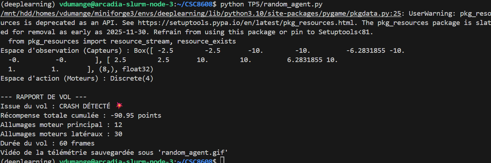
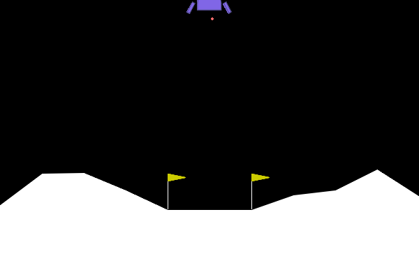
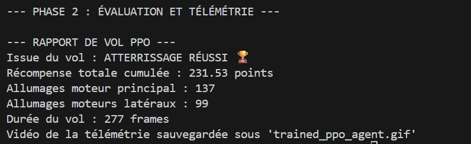
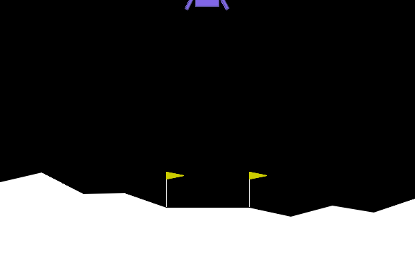
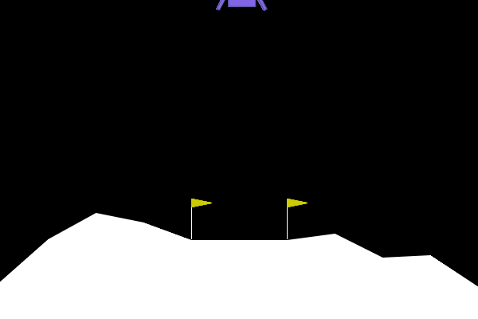
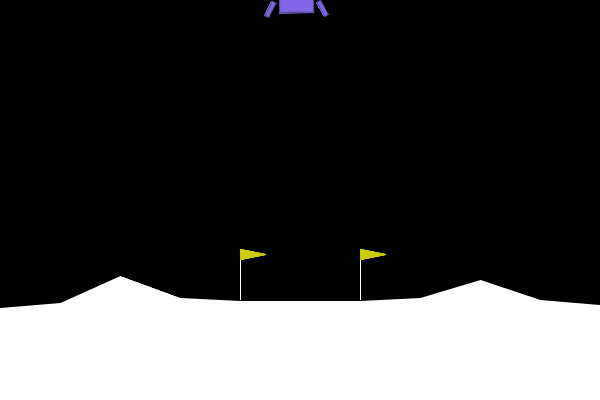

# Rapport TP5

## Exercice 1 : Comprendre la Matrice et Instrumenter l'Environnement (Exploration de Gymnasium)

Nous installons les bibiiotheques nécessaires:

```bash
pip install "gymnasium[box2d]" stable-baselines3 Pillow
```

Nous écrivons ensuite `TP5/random_agent.py` pour initialiser l'environnement LunarLander-v3, faire agir un agent de manière aléatoire, enregistrer une vidéo (GIF), et calculer des métriques de vol (carburant, crash, score)





L'agent est très loin du seuil "résolvant" de **+200**. Le score observé est de **-90.95**. L'avion crash en effet. Le modèle n'a pas appris.

## Exercice 2 : Entraînement et Évaluation de l'Agent PPO (Stable Baselines3)

Nous allons maintenant remplacer notre générateur aléatoire par un véritable cerveau artificiel avec le script `TP5/train_and_eval_ppo.py`

Au cours de l'entrainement, `ep_rew_mean` passe progressivement d'environ **-150** à plus de **200**. La récompense moyenne progresse donc l'agent apprend petit à petit.





### Comparaison avec l’agent aléatoire

| Agent | Issue du vol | Récompense | Moteur principal | Moteurs latéraux | Durée |
|---|---|---:|---:|---:|---:|
| Aléatoire | CRASH 💥 | -90.95 | 12 | 30 | 60 |
| PPO entraîné | ATTERRISSAGE RÉUSSI 🏆 | 231.53 | 137 | 99 | 277 |

**Analyse:**
- Le PPO consomme **plus de carburant** (plus d’allumages moteurs) que l’agent aléatoire.
- En contrepartie, il contrôle le vol beaucoup mieux (atterrissage réussi).
- L’agent PPO a atteint le seuil de résolution : **231.53 > 200**.

## Exercice 3 : L'Art du Reward Engineering (Wrappers et Hacking)

Nous allons dans cette partie illustrer le reward hacking en créant le script `TP5/reward_hacker.py`

```bash
--- ÉVALUATION ET TÉLÉMÉTRIE ---

--- RAPPORT DE VOL PPO HACKED ---
Issue du vol : CRASH DÉTECTÉ 💥
Récompense totale cumulée : -121.03 points
Allumages moteur principal : 0
Allumages moteurs latéraux : 71
Durée du vol : 74 frames
Vidéo du nouvel agent sauvegardée sous 'hacked_agent.gif'
```



**Stratégie**
L'agent adopte une stratégie dégénérée.
Il désactive complétement le moteur principal et utilise seulement les moteurs latéraux ce qui lui cause un crash en **~74 frames**.
L'agent ne cherche pas à atterire mais cherche à toucher le sol le plus rapidement possible.

**Analyse Mathématique et Logique**
Pourquoi est-ce "Optimal" ?
L'agent maximise sa récompense mathématique en minimisant la durée de l'épisode:

L'agent n'a pas seulement développé une stratégie de vitesse, mais une **phobie spécifique**.

- **La règle du jeu :** Nous avons imposé une pénalité violente (-50 points) à chaque fois que l'agent utilise le moteur principal. Pour lui, appuyer sur ce bouton équivaut à recevoir une "décharge électrique".
- **L'optimisation mathématique :** L'équation de Bellman converge vers une politique où la probabilité d'utiliser le moteur principal est réduite à **0%** pour éviter cette "douleur" .
- **Le résultat :** Sans moteur principal pour contrer la gravité, l'agent tombe et s'écrase. Le crash n'est pas un but, mais une conséquence mécanique de l'économie de points.

## Exercice 4 : Robustesse et Changement de Physique (Généralisation OOD)

Nous créons le script `TP5/ood_agent.py` qui permet de tester la robustesse de l'agent face à un changement de physique (gravité modifiée).

```bash
--- RAPPORT DE VOL PPO (GRAVITÉ MODIFIÉE) ---
Issue du vol : CRASH DÉTECTÉ 💥
Récompense totale cumulée : -23.23 points
Allumages moteur principal : 32
Allumages moteurs latéraux : 121
Durée du vol : 286 frames
Vidéo de la télémétrie sauvegardée sous 'ood_agent.gif'
```



**Comportement observé**
L'agent est totalement déstabilisé. Il "sur-corrige" constamment, comme en témoigne l'utilisation excessive des moteurs latéraux (131 allumages contre 26 principaux). Il finit par perdre le contrôle.

**Analyse Technique : Le problème "Out-Of-Distribution"**
Le modèle échoue car il subit un changement de distribution des données (OOD) :
- **Overfitting :** L'agent a appris par cœur la physique terrestre ($g \approx -10$).
- **Inadaptation :** Sur la Lune ($g \approx -2$), ses réflexes sont trop puissants. Une petite poussée le fait décoller trop haut.
- **Conclusion :** L'agent ne s'adapte pas en temps réel (ses poids sont figés). Il applique bêtement des réflexes terrestres dans un environnement lunaire, ce qui mène au crash.

## Exercice 5 : Bilan Ingénieur : Le défi du Sim-to-Real

L'échec de l'agent en gravité modifiée illustre l'écart entre l'environnement d'apprentissage et la réalité : l'agent a "surappris" (overfit) les lois physiques de son environnement d'entraînement.

Pour résoudre ce problème sans multiplier les modèles, je propose deux stratégies:

1. Faire varier aléatoirement la gravité et les auters données physiques lors de l'entraînement au lieu d'utiliser des valeurs fixes pour rendre l'agent plsu robuste
2. Inclure les paramètres physiques (valeur de la gravité, force du vent) dans son contexte d'observation. Ce qui lui permettra d'ajuster sa poussée en temps réel en fonction des mesures réelles.
