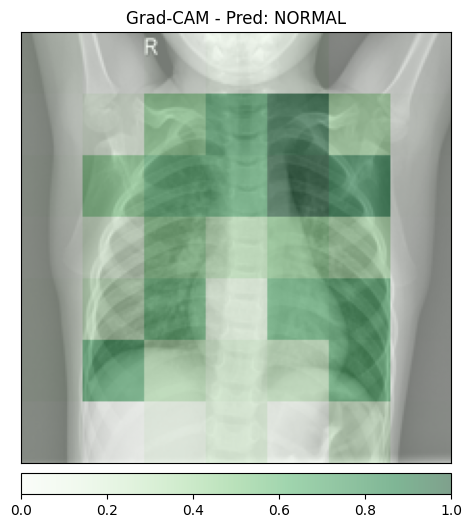
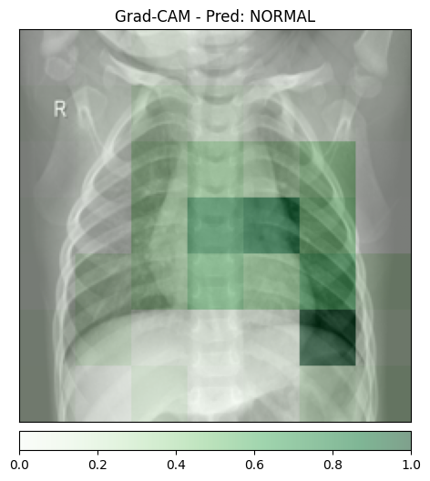
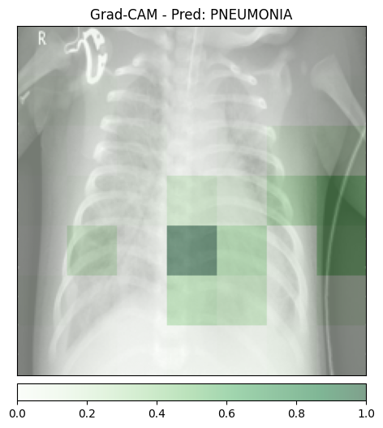
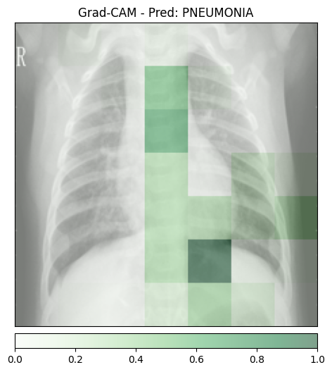
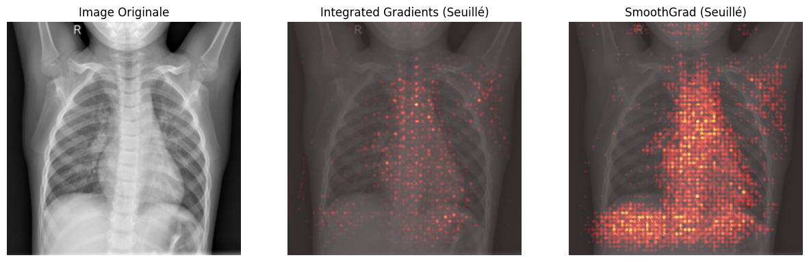
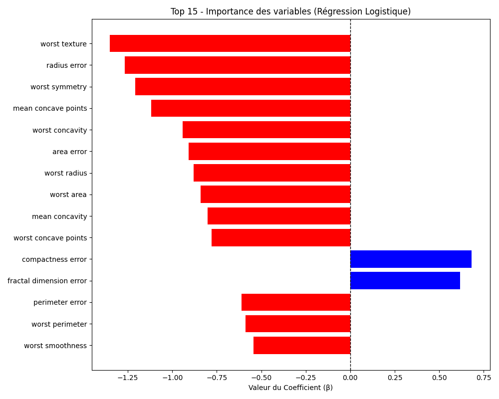
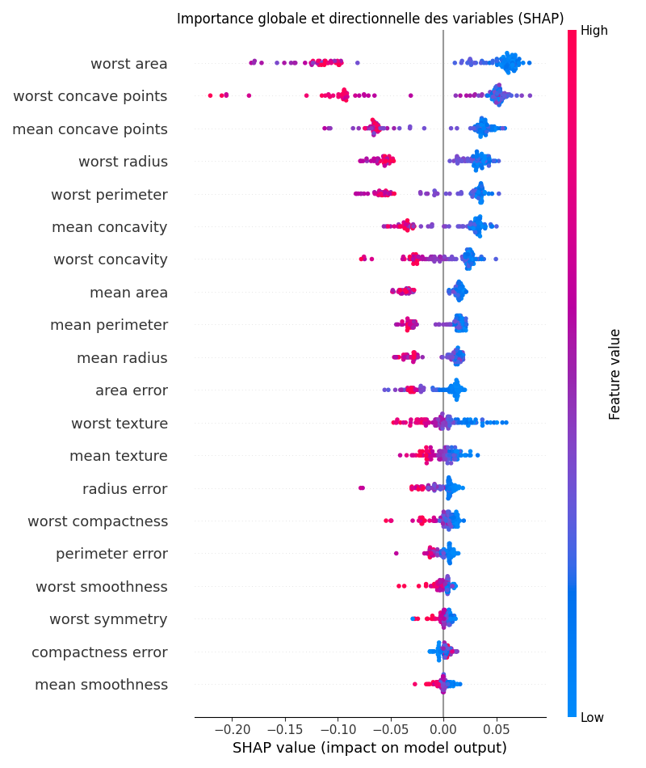
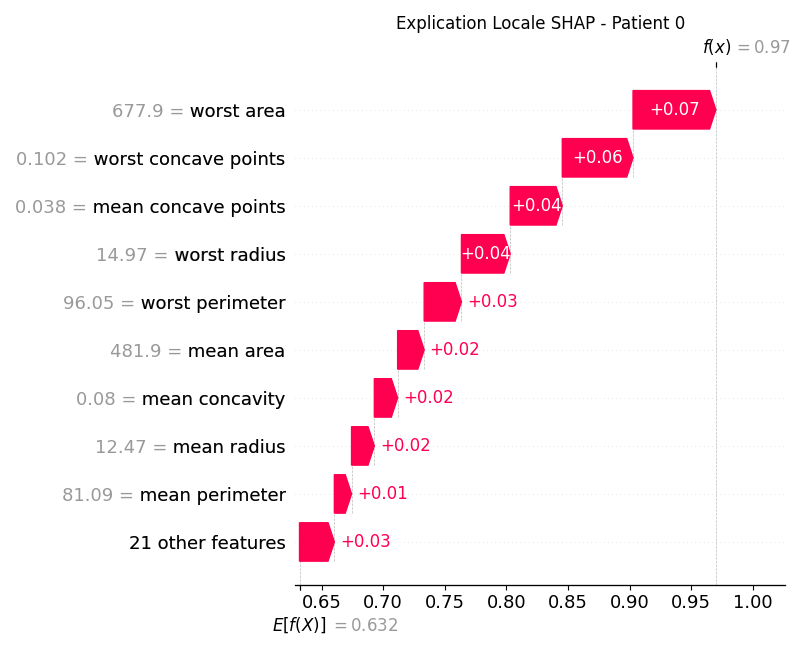

# Rapport TP6

## Exercice 1 : Mise en place, Inférence et Grad-CAM

Nous commençons par installer les dépendances nécessaires :

- `captum`
- `transformers`
- `matplotlib`
- `Pillow`

Nous téléchargeons ensuite les 4 images du TP :

- `normal_1.jpeg`
- `normal_2.jpeg`
- `pneumo_1.jpeg`
- `pneumo_2.jpeg`

Nous écrivons un script `01_gradcam.py` qui prédit une classe et produit une carte explicative.
Nous l'éxécutons sur les 4 images.

### Résultats visuels (Grad-CAM)

### normal_1

### normal_2

### pneumo_1

### pneumo_2

**Analyse des faux positifs**

Dans mon exécution, les images saines (`normal_1`, `normal_2`) ont été classées **NORMAL** ; je n’ai donc pas observé de faux positif sur ces 2 exemples.  
L’énoncé indique qu’un faux positif peut apparaître (prédiction **PNEUMONIA** sur image saine), ce qui n'est pas mon cas

**Granularité des cartes Grad-CAM**

Les zones colorées sont grossières et floues car Grad-CAM utilise la dernière couche convolutionnelle du ResNet.  
À ce niveau, la résolution spatiale très réduite notamment avec les strides et pooling.  
La heatmap est ensuite agrandie pour la superposer à l’image, ce qui donne un rendu en “gros blocs”.

## Exercice 2 : Integrated Gradients et SmoothGrad

Ctte fois-ci, nous allons essayé la technique d'integrated gradients avec le script `TP6/02_ig.py`

### Résultats

- Inférence classique : **~0.012 s**  
- Integrated Gradients (IG) : **1.7614 s**  
- SmoothGrad (IG x 100) : **14.5575 s**

**Cout de SmoothGrad**

- SmoothGrad est donc très coûteux (pres de 10x plus long que l'inférence), ce qui rend une génération strictement synchrone au premier clic peu réaliste en pratique clinique.
- On pourrait proposer par contre de renvoyer d'abord la prédiction (très rapide). En parralèle, envoyer SmoothGrad dans une queue Kafka pour éviter de bloquer l'interface du médecine.

**Carte signée**

- L’avantage mathématique d’une carte signée (bleu < 0, rouge > 0) est qu’elle conserve toute l’information du gradient (négatif ou positif)
- Avec le ReLU de Grad-CAM, toutes les valeurs négatives sont mises à 0, donc on perd cette information de “ce qui va contre la classe”. La carte signée est donc plus informative pour l’interprétation.

## Exercice 3 : Modélisation Intrinsèquement Interprétable (Glass-box) sur Données Tabulaires

Dans cette partie, nous entraînons une régression logistique sur le jeu de données Breast Cancer Wisconsin afin d’obtenir une explication directement lisible via les coefficients du modèle. `TP6/03_glassbox.py`

### Résultats

La caractéristique qui pousse le plus vers la classe **Maligne**  est : **`worst texture`**.

**Analyse**

L’avantage d’un modèle interprétable est que l’explication est directe : on lit les coefficients du modèle pour comprendre la décision, sans méthode d’explication supplémentaire comme Grad-CAM/IG.

## Exercice 4 : Explicabilité Post-Hoc avec SHAP sur un Modèle Complexe

### Résultats

**Explicabilité globale**

Les 2–3 variables les plus importantes selon SHAP sont : **`worst area`**, **`wors concave points`**, **`mean concave points`**.  
Alors que pour la régression logistique (Exercice 3) : la variable **`worst texture`** etait la plus importante selon SHAP.
On en déduit qu’il existe des biomarqueurs, mais que leur hiérarchie peut varier selon le type de modèle (linéaire vs non linéaire).

***Explicabilité locale (SHAP Waterfall, patient 0)**

Pour le patient 0, la feature qui contribue le plus à la prédiction finale est : **`worst area`**.  
Sa valeur numérique exacte pour ce patient est : **+0.07**.
